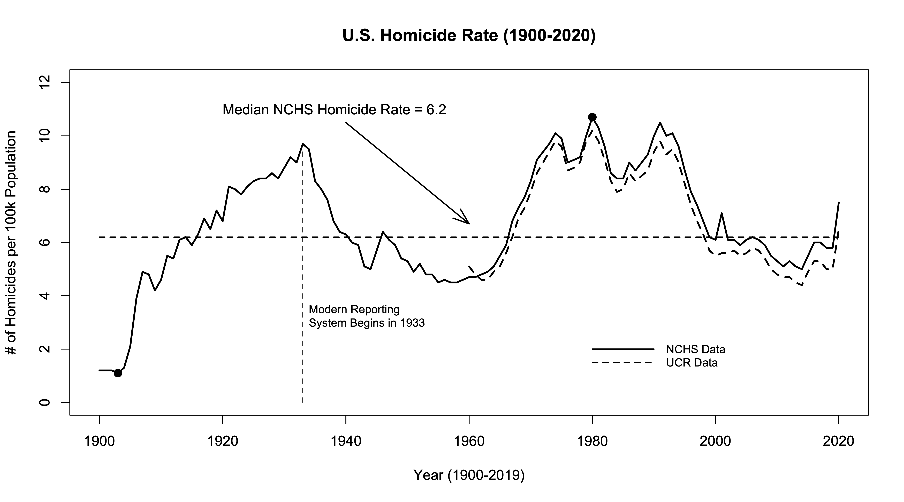
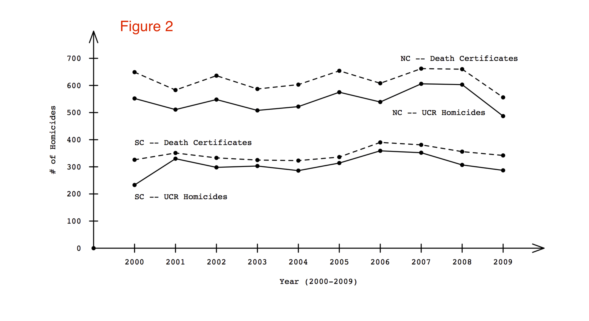
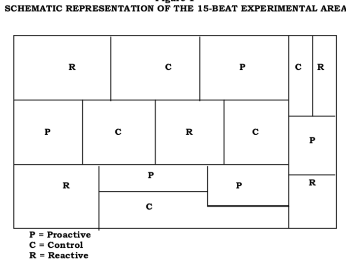
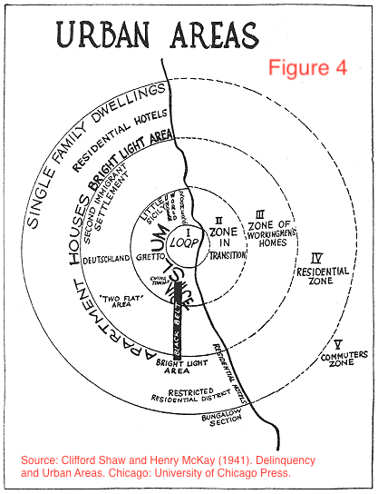

### CCJS 451-0201 - Crime &amp; Delinquency Prevention

* Meeting time: Monday-Wednesday-Friday 12-12:50
* Classroom: VMH 1203
* Instructor: Bobby Brame (rbrame@umd.edu)
* Office: LeFrak 2139
* Standing office hours: Monday 2-3:30 (meetings also available by appointment).

#### Class overview 

This class will cover a series of case studies examining a range of crime and delinquency prevention initiatives. We will consider the theoretical assumptions, program design, and evaluation evidence pertaining to each initiative.

#### UMd Course-related policies 

In this class, we will follow all of the guidance and requirements described in "Course-Related Policies and Resources for Undergraduate Students" [link](https://www.ugst.umd.edu/courserelatedpolicies.html). Please review the webpage and let me know if you have any questions. 

#### Course grades

Grades will be based on your performance on 4 in-class exams and 2 written prevention reports. Each of the 4 exams will be graded on a 0-100 point scale. Each of the 2 writing assignments will be graded on a 0-50 point scale. This means you can earn up to 500 points. The letter grade scale is: A+ = 484 and higher; A = 467-483; A-- = 450-466; B+ = 434-449; B = 417-433; B-- = 400-416; C+ = 384-399; C = 367-383; C-- = 350-366; D+ = 334-349; D = 317-333; D-- = 300-316; 
F = 299 and lower.

#### Excused absences

If you need to miss an exam or submit a late report (for an excused reason), please ensure you follow University procedures ([link](https://policies.umd.edu/assets/section-v/V-100G.pdf)) for timely notification and completion of late work. If you are unable to attend class due to COVID quarantine, please contact me to make arrangements.

#### Exams

Each exam will be a combination of multiple choice and true false questions. We will have time for review during the last class period before each exam. After exams have been graded, you can come to office hours or schedule an appointment to review your exam.

#### Prevention reports

For each report, you should identify a prevention program from this [link](https://crimesolutions.ojp.gov/programs-practices) that is not discussed in class. If you have any questions about whether the program you've identified is a prevention program or whether the peer-reviewed study you're planning to use is appropriate, you should consult with me (so you don't lose points). Your written submission will then be graded according to the following equally weighted 10-point rubric: 

* Describe the problem the program is targeting for prevention. Your description should include a characterization of the program as: (1) community; (2) developmental; and/or (3) situational crime prevention.
* Identify a peer-reviewed study evaluating the prevention program.
* Explain the evaluation's theoretical motivation.
* Identify the concepts that were measured in the evaluation.
* Describe 1 significant strength and 1 significant weakness of the measurement strategy.
* Explain the research design that was used for the evaluation.
* Describe 1 significant strength and 1 significant weakness of the research design.
* Explain the study's findings.
* Consider the study's policy and research implications.
* Assessment is typed and formatted with appropriate headings for each of the above items; good grammar, syntax, spelling, and writing form.

#### Example prevention report

* Prevention problem to be addressed: A concern arising in the literature is that many people who smoke tobacco products as adults began smoking when
they were young. Interventions that effectively limit the initiation of tobacco smoking during the adolescent years could lead to important lifelong health benefits. Because these interventions attempt to modify the onset and trajectory of substance use among individual young people to achieve life-span outcomes, they are best viewed as developmental prevention.

* Peer-reviewed study: R. Campbell, F. Starkey, J. Holliday, S. Audrey, M. Bloor, N. Parry-Langdon, R. Hughes, and L. Moore (2008).  An 
informal school-based peer-led intervention for smoking prevention in adolescence (ASSIST): a cluster randomised trial. *Lancet*, 371:1595-1602.

* Theoretical motivation: The authors raise the concern that there is an important link between adolescent onset of smoking and later adult smoking and health-related outcomes. They also recognize a long-standing pattern in the literature that one's own smoking behavior is correlated with peer smoking behavior. This correlation suggests that peers could become trusted messengers to convey health-related information to adolescents. The authors further argue that schools are a potentially useful setting for delivering health-related messages about smoking. 

* Concepts measured in the evaluation: The study measured: (1) variation in specially trained staff instruction and peer support in communicating smoking related health messages outside the classroom setting; and (2) variation in smoking behaviors at the time of instruction and 1-2 years after the instruction occurred. The researchers also measured several demographic, cultural, economic, and social network characteristics of the schools and the students involved in the study.

* Strength and weakness of measurement strategy: A weakness of the measurement strategy is that a small percentage of the people (less than 10%) were not available to be studied at the 1- and 2-year follow-up points. A strength of the measurement strategy is that 2 different approaches were used to measure cigarette smoking: (1) self-reports of smoking on surveys; and (2) saliva samples to measure cotinine levels. The authors reported good agreement between the two measurement methods (page 1599).

* Research design: The study randomly assigned students at some schools to receive the ASSIST intervention (treatment schools) while students at other schools were randomly assigned to receive the normal smoking education programs that were already in place. Students' tobacco smoking behaviors were measured at the time of the initial intervention and then again at 1- and 2-year follow-up points. 

* Strength and weakness of research design: The random assignment of schools to treatment and control groups is a strength. This ensures that the 2 groups of schools are mostly comparable to each other in terms of pretreatment characteristics. A weakness of the study is that despite the randomization, there were a few differences between the two groups of schools. One important difference (discussed on page 1598) is that students in the control schools reported more smoking
behaviors than the treatment school students at the baseline assessment.

* Study findings: The research found that students in the schools receiving the treatment had lower cigarette smoking rates than students in the control group schools. The patterns persisted at each of the follow-up points.

* Research and policy implications: The study was carried out in the United Kingdom and replication projects would be necessary to determine the generalizability of the results to other settings. The results do support the idea that school-based interventions that are delivered outside the classroom and with peer support may lead to lower rates of smoking initiation.

#### Course Outline

* Course overview.
* Methodology overview.
* Study 1: Hot spots policing ([link](https://static1.squarespace.com/static/5d809efd96f5c906aaf61f3d/t/601c032236cf8d4a7ccd459f/1612448549602/General+deterrent+effects+of+police+patrol+in+crime+HOT+SPOTS+A+randomized%2C+controlled+trial.pdf))
* Study 2: Kansas City gun experiment ([link](https://www.ojp.gov/pdffiles/kang.pdf))
* Exam #1: Friday 2/18/22
* Study 3: Treating vacant lots ([link](https://www.pnas.org/content/115/12/2946))
* First Prevention Program Assessment Due: Wednesday 3/2/22 
* Study 4: Moving to opportunity ([link](https://www-jstor-org.proxy-um.researchport.umd.edu/stable/pdf/25098732.pdf?refreqid=excelsior%3A11eae88cd2d56049f7ec2eeb467ca160&ab_segments=&origin=))
* Study 5: Communities that care ([link](https://www.ncbi.nlm.nih.gov/pmc/articles/PMC3946405/))
* Exam #2: Monday 3/14/22
* Study 6: Cambridge-Somerville youth study ([link](https://www.gwern.net/docs/sociology/1978-mccord.pdf))
* Study 7: Long-term effects of preschool programming ([link](https://link.springer.com/content/pdf/10.1007%2Fs11292-013-9190-3.pdf))
* Spring Break: 3/21/22-3/25/22
* Study 8: Baltimore City drug court ([link](https://ccjs.umd.edu/sites/ccjs.umd.edu/files/pubs/COMPLIANT-The%20Baltimore%20City%20Drug%20Treatment%20Court_0.pdf))
* Second Prevention Program Assessment Due: Monday 4/4/22
* Study 9: Drug Abuse Resistance Education (DARE) ([link](https://ajph-aphapublications-org.proxy-um.researchport.umd.edu/doi/epdf/10.2105/AJPH.84.9.1394))
* Exam #3: Wednesday 4/13/22
* Study 10: Street lighting and crime in New York ([link](https://link-springer-com.proxy-um.researchport.umd.edu/content/pdf/10.1007%2Fs10940-020-09490-6.pdf))
* Study 11: Target hardening and residential burglary ([link](https://link-springer-com.proxy-um.researchport.umd.edu/content/pdf/10.1007%2Fs11292-021-09494-7.pdf))
* Study 12: Retail theft prevention ([link](https://link-springer-com.proxy-um.researchport.umd.edu/content/pdf/10.1007/s11292-017-9284-4.pdf))
* Last Class Day Monday 5/9/22
* Exam #4: Tuesday 5/17/22; 9:00-10:00am

#### Lesson 1 - Monday 1/24/22

Today, we consider some key concepts for the semester:

* prevention (different types of)
* risk factors
* correlation and causation

Example: suppose we have a risk factor, *x* (i.e., delinquent peer exposure), and an adverse outcome, *y* (i.e., future criminality). A causal relationship between the two can be depicted as:

<p align="left">

</p>

* Next, we consider the possibility that some other factor (call it *z* - i.e., criminal propensity, low self-control, etc.) influences both *x* and *y*:

<p align="left">

</p>

* One way to (partially) resolve this problem is to break the arrow going from *z* to *x*:

<p align="left">

</p>

*Note*: here are 5 example exam questions based on the material covered in today's lesson.

1. Prevention programs are designed to:

   * a. punish offenders
   * b. compensate victims
   * c. reduce harm in the future
   * d. stigmatize people who commit crimes 

2. Criminologists distinguish between prevention programs that aim to reduce the onset of a problem and programs that aim to reduce the severity or continuation of a problem that has already arisen.

   * a. true
   * b. false
   
3. If *x* is a risk factor for *y* then we can say that *x* ___________ *y*.

   * a. causes
   * b. may or may not be a cause of

4. Which of the following processes indicates a causal connection between delinquent peer exposure and one's own criminality?

   * a. selection of friends with similar predispositions
   * b. peer pressure
   * c. coincidental connections between friends
   * d. aging and maturation
   * e. resilience

5. Preventive manipulation of correlational risk factors typically yields significant crime reduction benefits.

   * a. true
   * b. false

#### Lesson 2 - Wednesday 1/26/2022

1. How is crime measured?
2. What is the Uniform Crime Reporting (UCR) Program? ([link](https://ucr.fbi.gov/crime-in-the-u.s/2019/crime-in-the-u.s.-2019))
3. Identify the crime types covered by the UCR.
4. Describe the difference between the UCR crime and arrest reporting programs.
5. What levels of geography are covered by the UCR?
6. What is the National Crime Victimization Survey (NCVS)?

#### Lesson 3 - Friday 1/28/2022

7. What is the "dark figure of crime"?
8. Identify the crime types covered by the NCVS ([link](https://bjs.ojp.gov/sites/g/files/xyckuh236/files/media/document/cv20.pdf))
9. What levels of geography are covered by the NCVS?
10. What major crime type is covered by the UCR but not by the NCVS?
11. How can we measure homicides without using UCR data? (see figures below)

<p align="center">

</p>

<p align="center">

</p>

#### Lesson 4 - Monday 1/31/22

12. How is a crime rate calculated?
13. How is a clearance rate calculated?
14. How is an arrest rate calculated?

```Rout
Example:

* Suppose we have two cities and both cities have 100,000 population.
* One city has 125,000 people inside the city each day (potential robbery targets)
* The other city has 175,000 people inside the city each day.
* Now, suppose each city has 150 robberies in a particular month.
* Each city will have the same robbery rate in the UCR (150) -- but -- the real robbery rates are different.
* 150/125000 x 100,000 = 120 per 100K population
* 150/175000 x 100,000 = 86 per 100K population.
```

#### Lesson 5 - Wednesday 2/2/22

*Note*: You can go ahead and begin reading our first assigned article of the semester ([link](https://static1.squarespace.com/static/5d809efd96f5c906aaf61f3d/t/601c032236cf8d4a7ccd459f/1612448549602/General+deterrent+effects+of+police+patrol+in+crime+HOT+SPOTS+A+randomized%2C+controlled+trial.pdf)). We will begin discussing that paper on Friday 2/4. Also note that Friday 2/4 is the end of the drop/add period so we will plan to discuss the requirements and expectations for the prevention reports on Monday 2/7.

15. How does police participation vary between the UCR crime and arrest reporting programs?
16. In what ways is the UCR limited for studying demographic patterns of crime?
17. What is the UCR's hierarchy rule?
18. If an aggravated assault co-occurs with a burglary which event is counted for the UCR?
19. Which major crime occurs most frequently in both the UCR and the NCVS?
20. What denominator does the UCR use for crime and arrest rates?
21. What denominator does the NCVS use for personal victimization rates?
22. What denominator does the NCVS use for property victimization rates?
23. Which NCVS property crime consistently has the lowest police reporting rate?
24. Which NCVS property crime consistently has the highest police reporting rate?
25. What do we know about commercial robbery and burglary reporting rates from the NCVS?
26. How might an over-time crime change statistic be misleading if it is based on police records? (see example 1 below)
27. How might a between-city crime comparison be misleading if it is based on police records? (see example 2 below)

##### Example 1:

* Suppose we have a single city with 7700 residential burglaries reported to the police in year 1. 
* This same city has 7500 residential burglaries reported to the police in year 2.
* Now, suppose the reporting rate for residential burglaries decreased from 53% to 47% (year 1 to year 2).
* Then, the actual number of residential burglaries in year 1 is 7700/0.530 = 14,528
* And, the actual number of residential burglaries in year 2 is 7500/0.470 = 15,957

##### Example 2:

* Suppose we have a 2 cities, one, C1, with 300K households and the second, C2, with 200K households.
* C1 has 3700 residential burglaries reported to the police.
* C2 has 2300 residential burglaries reported to the police.
* The burglary report-to-police rate in C1 is 57% while the reporting rate in C2 is 49%.
* Which city has the higher police-based residential burglary rate?
* Which city has the higher real residential burglary rate?
* Solution: 
  - C1 has 3700/0.57 = 6491 burglaries
  - C2 has 2300/0.49 = 4694 burglaries
  - C1's police-known residential burglary rate = 3700/300K x 100K = 1233
  - C2's police-known residential burglary rate = 2300/200K x 100K = 1150
  - C1's real residential burglary rate = 6491/300K x 100K = 2164
  - C2's real residential burglary rate = 4694/300K x 100K = 2347

#### Lesson 6 - Friday 2/4/22

*Note*: Today, we begin reviewing our first assigned article of the semester ([link](https://static1.squarespace.com/static/5d809efd96f5c906aaf61f3d/t/601c032236cf8d4a7ccd459f/1612448549602/General+deterrent+effects+of+police+patrol+in+crime+HOT+SPOTS+A+randomized%2C+controlled+trial.pdf)). We will discuss the prevention reports on Monday.

28. What was the research goal of the Kansas City Preventive Patrol Experiment (KCPPE)?
29. What was the independent variable in the KCPPE?
30. What was the outcome variable in the KCPPE?
31. What do we mean by the term "routine preventive patrol"?
32. Describe the three experimental groups in the KCPPE.
33. Was preventive patrol dosage reliably measured in the KCPPE?
34. Is there more than one way to measure police patrol dosage?
35. How was the outcome measured in the KCPPE?
36. Describe the main conclusion of the KCPPE?
37. What did Sherman and Weisburd mean by the word "power"?
38. What factors were thought to reduce the power of the KCPPE?

<p align="center">

</p>

#### Lesson 7 - Monday 2/7/22

*Note*: today we will: (1) discuss the prevention reports and; (2) continue our review of the Sherman and Weisburd study.

39. Considering other studies of policing and street crime, do the KCPPE results seem typical?
40. What does the phrase "dose-response curve" mean?
41. What was the unit of analysis in the KCPPE?
42. What unit of analysis did Sherman and Weisburd advocate?
43. What was Fielding's (1751) critical observation?

#### Lesson 8 - Wednesday 2/9/22

44. Describe the empirical result that motivates the concept of a "hot spot".
45. Identify and describe the three principal concepts of deterrence theory.
46. What do we mean by the terms "general" and "specific" deterrence?
47. What is the central problem with deterrence and policing?
48. What problem could arise as a result of focusing police resources on hot spots?
49. How does a hot spots patrol strategy address the power concerns in police-crime studies?
50. What measurement problem is not improved by a study of hot spots patrol?
51. What city did Sherman and Weisburd study in their research on hot spots?
52. What political considerations arose in the approval of the hot spots patrol study?

<p align="center">

</p>

#### Lesson 9 - Friday 2/11/22

53. How was a hot spot defined for purposes of Sherman and Weisburd's study?
54. What did Sherman and Weisburd mean by the term "hard crime calls"?
55. What research design was used to evaluate the effects of intensive hot spot patrol in Sherman and Weisburd's study?
56. Describe the "noise" problem identified by Sherman and Weisburd?
57. Why is the "noise" problem not a threat to the validity of the 
58. What do Sherman and Weisburd mean by the use of the term "internal validity"?
59. What were the three goals of the address cluster inspections?
60. Why was it important that an external researcher randomized the hot spots to treatment and control conditions?
61. What did a typical hot spot look like?
62. At what time of the day did hot spots typically receive the most calls for service?
63. What time period of the day were the experimental conditions maintained?
64. What did Sherman and Weisburd mean by the term "crackdown-backoff pattern"?


#### Lesson 10 - Monday 2/14/22

65. Did the experimental condition mostly affect the quantity or the quality of the police presence?
66. What was the police coverage goal for the hot spots in the treatment group?
67. Was the police coverage goal actually achieved?
68. How did the research team monitor what was occurring in the treatment and control conditions?
69. What were the two key outcomes in the Minneapolis hot spots patrol study?
70. Does a study like the one conducted in Minneapolis raise safety issues for observers?
71. How long did the hot spots patrol study last?

#### Lesson 11 - Wednesday 2/16/22

72. Was there a measurable difference in the amount of police coverage between the two groups?
73. What experimental complication arose during the summer of 1989?
74. What measurement problem arose in the fall of 1989?
75. What was the authors' rationale for preferring an analysis cutoff date of July 31, 1989?
76. How did the analysis results change when the implementation deteriorated?
77. How did the outcome patterns vary between the hard and soft crime calls?
78. Were the disorder results consistent with the theoretical predictions?
