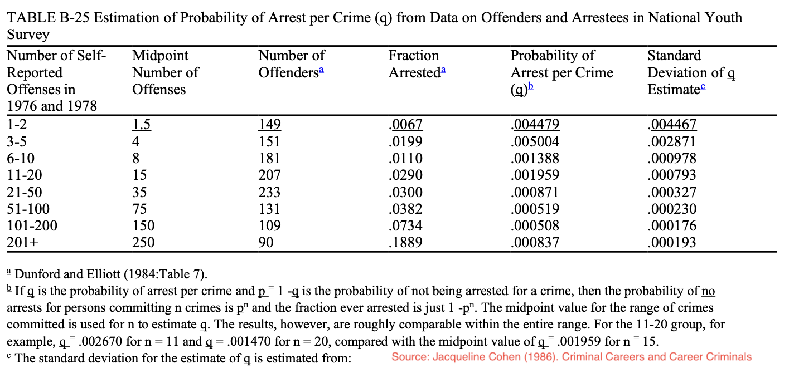

### CCJS 451-0201 - Crime &amp; Delinquency Prevention

* Meeting time: Monday-Wednesday-Friday 12-12:50
* Classroom: VMH 1203
* Instructor: Bobby Brame (rbrame@umd.edu)
* Office: LeFrak 2139
* Standing office hours: Monday 2-3:30 (meetings also available by appointment).

#### Class overview 

This class will cover a series of case studies examining a range of crime and delinquency prevention initiatives. We will consider the theoretical assumptions, program design, and evaluation evidence pertaining to each initiative.

#### UMd Course-related policies 

In this class, we will follow all of the guidance and requirements described in "Course-Related Policies and Resources for Undergraduate Students" [link](https://www.ugst.umd.edu/courserelatedpolicies.html). Please review the webpage and let me know if you have any questions. 

#### Course grades

Grades will be based on your performance on 4 in-class exams and 2 written prevention reports. Each of the 4 exams will be graded on a 0-100 point scale. Each of the 2 writing assignments will be graded on a 0-50 point scale. This means you can earn up to 500 points. The letter grade scale is: A+ = 484 and higher; A = 467-483; A-- = 450-466; B+ = 434-449; B = 417-433; B-- = 400-416; C+ = 384-399; C = 367-383; C-- = 350-366; D+ = 334-349; D = 317-333; D-- = 300-316; 
F = 299 and lower.

#### Excused absences

If you need to miss an exam or submit a late report (for an excused reason), please ensure you follow University procedures ([link](https://policies.umd.edu/assets/section-v/V-100G.pdf)) for timely notification and completion of late work. If you are unable to attend class due to COVID quarantine, please contact me to make arrangements.

#### Exams

Each exam will be a combination of multiple choice and true false questions. We will have time for review during the last class period before each exam. After exams have been graded, you can come to office hours or schedule an appointment to review your exam.

#### Prevention reports

For each report, you should identify a prevention program from this [link](https://crimesolutions.ojp.gov/programs-practices) that is not discussed in class. If you have any questions about whether the program you've identified is a prevention program or whether the peer-reviewed study you're planning to use is appropriate, you should consult with me (so you don't lose points). Your written submission will then be graded according to the following equally weighted 10-point rubric: 

* Describe the problem the program is targeting for prevention. Your description should include a characterization of the program as: (1) community; (2) developmental; and/or (3) situational crime prevention.
* Identify a peer-reviewed evaluation study evaluating the prevention program.
* Explain the peer-reviewed evaluation study's theoretical motivation.
* Identify the concepts that were measured in the peer-reviewed evaluation study.
* Describe 1 significant strength and 1 significant weakness of the measurement strategy that was used in the peer-reviewed evaluation study.
* Explain the research design that was used in the peer-reviewed evaluation study.
* Describe 1 significant strength and 1 significant weakness of the research design used in the peer-reviewed evaluation study.
* Explain the peer-reviewed evaluation study's findings.
* Consider the peer-reviewed evaluation study's policy and research implications.
* Assessment is typed and formatted with appropriate headings for each of the above items; good grammar, syntax, spelling, and writing form.

#### Example prevention report

* Prevention problem to be addressed: A concern arising in the literature is that many people who smoke tobacco products as adults began smoking when
they were young. Interventions that effectively limit the initiation of tobacco smoking during the adolescent years could lead to important lifelong health benefits. Because these interventions attempt to modify the onset and trajectory of substance use among individual young people to achieve life-span outcomes, they are best viewed as developmental prevention.

* Peer-reviewed study: R. Campbell, F. Starkey, J. Holliday, S. Audrey, M. Bloor, N. Parry-Langdon, R. Hughes, and L. Moore (2008).  An 
informal school-based peer-led intervention for smoking prevention in adolescence (ASSIST): a cluster randomised trial. *Lancet*, 371:1595-1602.

* Theoretical motivation: The authors raise the concern that there is an important link between adolescent onset of smoking and later adult smoking and health-related outcomes. They also recognize a long-standing pattern in the literature that one's own smoking behavior is correlated with peer smoking behavior. This correlation suggests that peers could become trusted messengers to convey health-related information to adolescents. The authors further argue that schools are a potentially useful setting for delivering health-related messages about smoking. 

* Concepts measured in the evaluation: The study measured: (1) variation in specially trained staff instruction and peer support in communicating smoking related health messages outside the classroom setting; and (2) variation in smoking behaviors at the time of instruction and 1-2 years after the instruction occurred. The researchers also measured several demographic, cultural, economic, and social network characteristics of the schools and the students involved in the study.

* Strength and weakness of measurement strategy: A weakness of the measurement strategy is that a small percentage of the people (less than 10%) were not available to be studied at the 1- and 2-year follow-up points. A strength of the measurement strategy is that 2 different approaches were used to measure cigarette smoking: (1) self-reports of smoking on surveys; and (2) saliva samples to measure cotinine levels. The authors reported good agreement between the two measurement methods (page 1599).

* Research design: The study randomly assigned students at some schools to receive the ASSIST intervention (treatment schools) while students at other schools were randomly assigned to receive the normal smoking education programs that were already in place. Students' tobacco smoking behaviors were measured at the time of the initial intervention and then again at 1- and 2-year follow-up points. 

* Strength and weakness of research design: The random assignment of schools to treatment and control groups is a strength. This ensures that the 2 groups of schools are mostly comparable to each other in terms of pretreatment characteristics. A weakness of the study is that despite the randomization, there were a few differences between the two groups of schools. One important difference (discussed on page 1598) is that students in the control schools reported more smoking
behaviors than the treatment school students at the baseline assessment.

* Study findings: The research found that students in the schools receiving the treatment had lower cigarette smoking rates than students in the control group schools. The patterns persisted at each of the follow-up points.

* Research and policy implications: The study was carried out in the United Kingdom and replication projects would be necessary to determine the generalizability of the results to other settings. The results do support the idea that school-based interventions that are delivered outside the classroom and with peer support may lead to lower rates of smoking initiation.

#### Course Outline

* Course overview.
* Methodology overview.
* Study 1: Hot spots policing ([link](https://static1.squarespace.com/static/5d809efd96f5c906aaf61f3d/t/601c032236cf8d4a7ccd459f/1612448549602/General+deterrent+effects+of+police+patrol+in+crime+HOT+SPOTS+A+randomized%2C+controlled+trial.pdf))
* Study 2: Kansas City gun experiment ([link](https://www.ojp.gov/pdffiles/kang.pdf))
* Exam #1: Friday 2/18/22
* Study 3: Treating vacant lots ([link](https://www.pnas.org/content/115/12/2946))
* First Prevention Program Assessment Due: Wednesday 3/2/22 
* Study 4: Moving to opportunity ([link](https://www-jstor-org.proxy-um.researchport.umd.edu/stable/pdf/25098732.pdf?refreqid=excelsior%3A11eae88cd2d56049f7ec2eeb467ca160&ab_segments=&origin=))
* Study 5: Communities that care ([link](https://www.ncbi.nlm.nih.gov/pmc/articles/PMC3946405/))
* Exam #2: Monday 3/14/22
* Study 6: Cambridge-Somerville youth study ([link](https://www.gwern.net/docs/sociology/1978-mccord.pdf))
* Study 7: Long-term effects of preschool programming ([link](https://link.springer.com/content/pdf/10.1007%2Fs11292-013-9190-3.pdf))
* Spring Break: 3/21/22-3/25/22
* Study 8: Baltimore City drug court ([link](https://ccjs.umd.edu/sites/ccjs.umd.edu/files/pubs/COMPLIANT-The%20Baltimore%20City%20Drug%20Treatment%20Court_0.pdf))
* Second Prevention Program Assessment Due: Monday 4/4/22
* Study 9: Drug Abuse Resistance Education (DARE) ([link](https://ajph-aphapublications-org.proxy-um.researchport.umd.edu/doi/epdf/10.2105/AJPH.84.9.1394))
* Exam #3: Wednesday 4/13/22
* Study 10: Street lighting and crime in New York ([link](https://link-springer-com.proxy-um.researchport.umd.edu/content/pdf/10.1007%2Fs10940-020-09490-6.pdf))
* Study 11: Target hardening and residential burglary ([link](https://link-springer-com.proxy-um.researchport.umd.edu/content/pdf/10.1007%2Fs11292-021-09494-7.pdf))
* Study 12: Retail theft prevention ([link](https://link-springer-com.proxy-um.researchport.umd.edu/content/pdf/10.1007/s11292-017-9284-4.pdf))
* Last Class Day Monday 5/9/22
* Exam #4: Tuesday 5/17/22; 9:00-10:00am

#### Lesson 1 - Monday 1/24/22

Today, we consider some key concepts for the semester:

* prevention (different types of)
* risk factors
* correlation and causation

Example: suppose we have a risk factor, *x* (i.e., delinquent peer exposure), and an adverse outcome, *y* (i.e., future criminality). A causal relationship between the two can be depicted as:

<p align="left">

</p>

* Next, we consider the possibility that some other factor (call it *z* - i.e., criminal propensity, low self-control, etc.) influences both *x* and *y*:

<p align="left">

</p>

* One way to (partially) resolve this problem is to break the arrow going from *z* to *x*:

<p align="left">

</p>

*Note*: here are 5 example exam questions based on the material covered in today's lesson.

1. Prevention programs are designed to:

   * a. punish offenders
   * b. compensate victims
   * c. reduce harm in the future
   * d. stigmatize people who commit crimes 

2. Criminologists distinguish between prevention programs that aim to reduce the onset of a problem and programs that aim to reduce the severity or continuation of a problem that has already arisen.

   * a. true
   * b. false
   
3. If *x* is a risk factor for *y* then we can say that *x* ___________ *y*.

   * a. causes
   * b. may or may not be a cause of

4. Which of the following processes indicates a causal connection between delinquent peer exposure and one's own criminality?

   * a. selection of friends with similar predispositions
   * b. peer pressure
   * c. coincidental connections between friends
   * d. aging and maturation
   * e. resilience

5. Preventive manipulation of correlational risk factors typically yields significant crime reduction benefits.

   * a. true
   * b. false

#### Lesson 2 - Wednesday 1/26/2022

1. How is crime measured?
2. What is the Uniform Crime Reporting (UCR) Program? ([link](https://ucr.fbi.gov/crime-in-the-u.s/2019/crime-in-the-u.s.-2019))
3. Identify the crime types covered by the UCR.
4. Describe the difference between the UCR crime and arrest reporting programs.
5. What levels of geography are covered by the UCR?
6. What is the National Crime Victimization Survey (NCVS)?

#### Lesson 3 - Friday 1/28/2022

7. What is the "dark figure of crime"?
8. Identify the crime types covered by the NCVS ([link](https://bjs.ojp.gov/sites/g/files/xyckuh236/files/media/document/cv20.pdf))
9. What levels of geography are covered by the NCVS?
10. What major crime type is covered by the UCR but not by the NCVS?
11. How can we measure homicides without using UCR data? (see figures below)

<p align="center">

</p>

<p align="center">

</p>

#### Lesson 4 - Monday 1/31/22

12. How is a crime rate calculated?
13. How is a clearance rate calculated?
14. How is an arrest rate calculated?

```Rout
Example:

* Suppose we have two cities and both cities have 100,000 population.
* One city has 125,000 people inside the city each day (potential robbery targets)
* The other city has 175,000 people inside the city each day.
* Now, suppose each city has 150 robberies in a particular month.
* Each city will have the same robbery rate in the UCR (150) -- but -- the real robbery rates are different.
* 150/125000 x 100,000 = 120 per 100K population
* 150/175000 x 100,000 = 86 per 100K population.
```

#### Lesson 5 - Wednesday 2/2/22

*Note*: You can go ahead and begin reading our first assigned article of the semester ([link](https://static1.squarespace.com/static/5d809efd96f5c906aaf61f3d/t/601c032236cf8d4a7ccd459f/1612448549602/General+deterrent+effects+of+police+patrol+in+crime+HOT+SPOTS+A+randomized%2C+controlled+trial.pdf)). We will begin discussing that paper on Friday 2/4. Also note that Friday 2/4 is the end of the drop/add period so we will plan to discuss the requirements and expectations for the prevention reports on Monday 2/7.

15. How does police participation vary between the UCR crime and arrest reporting programs?
16. In what ways is the UCR limited for studying demographic patterns of crime?
17. What is the UCR's hierarchy rule?
18. If an aggravated assault co-occurs with a burglary which event is counted for the UCR?
19. Which major crime occurs most frequently in both the UCR and the NCVS?
20. What denominator does the UCR use for crime and arrest rates?
21. What denominator does the NCVS use for personal victimization rates?
22. What denominator does the NCVS use for property victimization rates?
23. Which NCVS property crime consistently has the lowest police reporting rate?
24. Which NCVS property crime consistently has the highest police reporting rate?
25. What do we know about commercial robbery and burglary reporting rates from the NCVS?
26. How might an over-time crime change statistic be misleading if it is based on police records? (see example 1 below)
27. How might a between-city crime comparison be misleading if it is based on police records? (see example 2 below)

##### Example 1:

* Suppose we have a single city with 7700 residential burglaries reported to the police in year 1. 
* This same city has 7500 residential burglaries reported to the police in year 2.
* Now, suppose the reporting rate for residential burglaries decreased from 53% to 47% (year 1 to year 2).
* Then, the actual number of residential burglaries in year 1 is 7700/0.530 = 14,528
* And, the actual number of residential burglaries in year 2 is 7500/0.470 = 15,957

##### Example 2:

* Suppose we have a 2 cities, one, C1, with 300K households and the second, C2, with 200K households.
* C1 has 3700 residential burglaries reported to the police.
* C2 has 2300 residential burglaries reported to the police.
* The burglary report-to-police rate in C1 is 57% while the reporting rate in C2 is 49%.
* Which city has the higher police-based residential burglary rate?
* Which city has the higher real residential burglary rate?
* Solution: 
  - C1 has 3700/0.57 = 6491 burglaries
  - C2 has 2300/0.49 = 4694 burglaries
  - C1's police-known residential burglary rate = 3700/300K x 100K = 1233
  - C2's police-known residential burglary rate = 2300/200K x 100K = 1150
  - C1's real residential burglary rate = 6491/300K x 100K = 2164
  - C2's real residential burglary rate = 4694/300K x 100K = 2347

#### Lesson 6 - Friday 2/4/22

*Note*: Today, we begin reviewing our first assigned article of the semester ([link](https://static1.squarespace.com/static/5d809efd96f5c906aaf61f3d/t/601c032236cf8d4a7ccd459f/1612448549602/General+deterrent+effects+of+police+patrol+in+crime+HOT+SPOTS+A+randomized%2C+controlled+trial.pdf)). We will discuss the prevention reports on Monday.

28. What was the research goal of the Kansas City Preventive Patrol Experiment (KCPPE)?
29. What was the independent variable in the KCPPE?
30. What was the outcome variable in the KCPPE?
31. What do we mean by the term "routine preventive patrol"?
32. Describe the three experimental groups in the KCPPE.
33. Was preventive patrol dosage reliably measured in the KCPPE?
34. Is there more than one way to measure police patrol dosage?
35. How was the outcome measured in the KCPPE?
36. Describe the main conclusion of the KCPPE?
37. What did Sherman and Weisburd mean by the word "power"?
38. What factors were thought to reduce the power of the KCPPE?

<p align="center">

</p>

#### Lesson 7 - Monday 2/7/22

*Note*: today we will: (1) discuss the prevention reports and; (2) continue our review of the Sherman and Weisburd study.

39. Considering other studies of policing and street crime, do the KCPPE results seem typical?
40. What does the phrase "dose-response curve" mean?
41. What was the unit of analysis in the KCPPE?
42. What unit of analysis did Sherman and Weisburd advocate?
43. What was Fielding's (1751) critical observation?

#### Lesson 8 - Wednesday 2/9/22

44. Describe the empirical result that motivates the concept of a "hot spot".
45. Identify and describe the three principal concepts of deterrence theory.
46. What do we mean by the terms "general" and "specific" deterrence?
47. What is the central problem with deterrence and policing?
48. What problem could arise as a result of focusing police resources on hot spots?
49. How does a hot spots patrol strategy address the power concerns in police-crime studies?
50. What measurement problem is not improved by a study of hot spots patrol?
51. What city did Sherman and Weisburd study in their research on hot spots?
52. What political considerations arose in the approval of the hot spots patrol study?

<p align="center">

</p>

#### Lesson 9 - Friday 2/11/22

53. How was a hot spot defined for purposes of Sherman and Weisburd's study?
54. What did Sherman and Weisburd mean by the term "hard crime calls"?
55. What research design was used to evaluate the effects of intensive hot spot patrol in Sherman and Weisburd's study?
56. Describe the "noise" problem identified by Sherman and Weisburd?
57. Why is the "noise" problem not a threat to the validity of the Minneapolis hot spots study?
58. What do Sherman and Weisburd mean by the use of the term "internal validity"?
59. What were the three goals of the address cluster inspections?
60. Why was it important that an external researcher randomized the hot spots to treatment and control conditions?
61. What did a typical hot spot look like?
62. At what time of the day did hot spots typically receive the most calls for service?
63. What time period of the day were the experimental conditions maintained?
64. What did Sherman and Weisburd mean by the term "crackdown-backoff pattern"?


#### Lesson 10 - Monday 2/14/22

65. Did the experimental condition mostly affect the quantity or the quality of the police presence?
66. What was the police coverage goal for the hot spots in the treatment group?
67. Was the police coverage goal actually achieved?
68. How did the research team monitor what was occurring in the treatment and control conditions?
69. What were the two key outcomes in the Minneapolis hot spots patrol study?
70. Does a study like the one conducted in Minneapolis raise safety issues for observers?
71. How long did the hot spots patrol study last?

#### Lesson 11 - Wednesday 2/16/22

* Reminder: our first exam will be on Friday 2/18/22. We will have some review time for the exam in today's class.

72. Was there a measurable difference in the amount of police coverage between the two groups?
73. What experimental complication arose during the summer of 1989?
74. What measurement problem arose in the fall of 1989?
75. What was the authors' rationale for preferring an analysis cutoff date of July 31, 1989?
76. How did the analysis results change when the implementation deteriorated?
77. How did the outcome patterns vary between the hard and soft crime calls?
78. Were the study results consistent with the theoretical predictions?
79. Was there evidence of displacement?
80. Do post-intervention increases in crime contradict the idea of effective treatment?

*Note*: you can read about the rating that hot spots policing interventions received at [Crime Solutions](https://crimesolutions.ojp.gov/ratedpractices/8).

* Example Questions

```rout
1. Which of the following crimes occurs most frequently in the NCVS?

a. robbery
b. burglary
c. larceny
d. aggravated assault

2. Which level of geography was the NCVS designed to cover?

a. state
b. county
c. city
d. national
e. metropolitan area

3. The "dark figure of crime" problem is caused by:

a. the hierarchy rule
b. ambiguity about the size of the population
c. difficulties in counting homicides
d. crimes not reported to the police
e. simple assaults which are counted by the NCVS but not the UCR index

4. If police-counted crime statistics change over time, then we know that crime has changed over that time period.

a. true
b. false

5. An important problem in the Kansas City Preventive Patrol Experiment was:

a. many crime victims were unwilling to speak with the researchers
b. the police officers resisted participating in the study
c. the exact dosage of police patrol coverage was not well measured
d. there was no significant difference in the patrol coverage for the different beats
e. the follow-up period wasn't long enough

6. The Minneapolis hot spot study by Sherman and Weisburd found strong evidence of displacement.

a. true
b. false

7. If crime increases after an intervention occurs, that evidence demonstrates:

a. the intervention was criminogenic
b. the intervention was ineffective
c. we can't draw any conclusions about the intervention's effects
```

#### Lesson 12 - Monday 2/21/22 - Note: Exam 2 Starts Here

* Reminder: your first prevention reports are due next Wednesday 3/2/22. Please bring a paper copy with you to class
* Your first exams are mostly graded. I will post grades by end of the day on Wednesday.
* We now turn our attention to the Kansas City Gun Experiment ([link](https://www.ojp.gov/pdffiles/kang.pdf)).

81. What is a potential response to the concern that there are too many guns in circulation?
82. Describe the main hypothesis of the Kansas City Gun Experiment.
83. What is the difference between a theory and a hypothesis?
84. What two theories can be used to generate the hypothesis that was tested in the Kansas City Gun Experiment?
85. Was the Kansas City Gun Experiment able to discern which of the two gun-crime theories was correct?
86. What is the critical feature of the area that received the intervention (i.e., the target beat)?
87. What was the main objective of the intervention in the Kansas City Gun Experiment?

#### Lesson 13 - Wednesday 2/23/22

88. In what way, does the Kansas City Gun Experiment fall short of the definition of a true experimental design?
89. Would confirmation of the Kansas City Gun Experiment's hypothesis prove that gun seizures reduce gun crime? Why or why not?
90. Is the Kansas City Gun Experiment an exercise in deductive or inductive science? Explain.
91. Why was the experiment interrupted?
92. What constitutional question is at the center of the Kansas City Gun Experiment?

#### Lesson 14 - Friday 2/25/22

93. What burden of proof is required to justify an arrest?
94. What burden of proof is required to justify a stop?
95. What is a consent search?
96. What occurred as a result of the intervention in the target beat?
97. Did gun seizures change in the target beat?
98. Did gun seizures change in the control beat?
99. Did gun crimes change in the target beat?
100. Did gun crimes change in the control beat?
101. How did the researchers investigate the possibility of displacement?
102. Did the researchers find any significant evidence of displacement?

#### Lesson 15 - Monday 2/28/22

*Note*: Today we move to our next reading covering the issue of how to treat blighted vacant lots in urban spaces ([link](https://www.pnas.org/content/pnas/115/12/2946.full.pdf)).

*Note*: The question has been raised whether a prevention report can be written on a topic that is similar to a topic covered in class as long as the report is focused on a different evaluation study. The answer to this question is "yes." 

103. What has been the traditional response to the problem of blighted and vacant land in American cities?
104. What are the commonly experienced unintended consequences of the traditional approach to dealing with vacant land?
105. Describe the "main intervention" used in the urban vacant land study.
106. Explain the research design used in the urban vacant land study.
107. What do the authors of the urban vacant land study mean by the phrase "baseline balance"?

#### Lesson 16 - Wednesday 3/2/22

108. Why did the urban vacant land study take over 6 years to complete?
109. What was the treatment noncompliance problem in the urban vacant land study?
110. What is an "intent-to-treat" analysis?
111. What was the main finding of the urban vacant land study?
112. What did the authors of the urban vacant land study find when they tested for displacement effects?
113. Describe the pattern of findings between the two micro-neighborhoods that emerged from the ethnographic study.
114. What did the ethnographers observe when they studied the drug sales behavior in areas around the vacant lots?

#### Lesson 17 - Friday 3/4/22

115. Why would gentrification be a source of concern in the urban vacant land study?
116. What would be the primary way of checking on whether gentrification occurred?
117. How were the key outcomes measured in the urban vacant land study?
118. Was gentrification a significant problem in the vacant land intervention?
119. What was the most important strength of the urban vacant land study?
120. What was the most important weakness of the urban vacant land study?

#### Lesson 18 - Monday 3/7/22

*Reminder*: Exam 2 is scheduled for next Monday - 3/14/22

*Note:* Our next study: Moving to Opportunity ([link](https://www-jstor-org.proxy-um.researchport.umd.edu/stable/pdf/25098732.pdf?refreqid=excelsior%3A11eae88cd2d56049f7ec2eeb467ca160&ab_segments=&origin=))

121. Why is it hard to test the idea "that disadvantaged neighborhoods are criminogenic"?
122. What do the MTO authors mean by the term "identification problem"?
123. How could an experimental design help to overcome the identification problem?
124. Which 5 cities were included in the MTO study?
125. Who was eligible to be in the MTO program?
126. Describe the three randomly assigned experimental groups.
127. What is Section 8 housing?
128. What did the housing vouchers allow people in the experimental group to do?
129. How long did MTO movers have to stay in the low poverty tract to which they moved?
130. What happened if a MTO mover stayed in the new area for less than 1 year?
131. What did the MTO randomization procedure accomplish methodologically?
132. What outcomes were measured in the MTO study?

#### Lesson 19 - Friday 3/11/22

*Note*: Exam 2 is postponed to Wednesday 3/16/22. We will have some review time during class on Monday 3/14/22.

133. Describe the survey nonresponse problem in the MTO study.
134. Did the randomization procedure used in the MTO study achieve baseline balance?
135. Was there a treatment compliance issue in the MTO study?
136. What was the pattern of treatment noncompliance in the MTO study?
137. What effect did the MTO experiment have on census tract circumstances of youth?

#### Lesson 20 - Monday 3/14/22

*Notes*: Exam 2 will be on Wednesday 3/16/22. I will have prevention reports finished and grades posted by end of the day today.

138. What was the effect of the MTO experiment on local social organization and order maintenance?
139. How did the effects of MTO on local social organization and order maintenance vary by treatment group?
140. What measurement problem arose with self-reported arrests in the MTO study?
141. How did the authors address the self-reported arrest measurement problem in the MTO study?
142. Did the MTO intervention have an effect on official record arrest outcomes?
143. What variable seems to condition the effect of MTO on official arrest outcomes?
144. What results emerged after examining the self-reported arrest data in the MTO study?

Practice Exam Questions

1. The ______ beat in the Kansas City Gun Experiment included a large park

* a. target
* b. control

2. The Kansas City Gun Experiment had to be temporarily interrupted because:

* a. there was a problem with police-community relations
* b. the police weren't seizing enough guns
* c. there was a disruption in funding
* d. a new police chief was hired in the middle of the study
* e. there was a court challenge to the police practices in the target beat

3. What pattern did ethnographers observe in the urban vacant land study?

* a. when confronted in front of homes, drug sellers retaliated against neighbors
* b. when confronted in front of homes, drug sellers moved to the vacant lots
* c. when confronted in front of homes, drug sellers left the neighborhood

4. The authors of the urban vacant land study rigorously tested for gentrification effects.

* a. true
* b. false

5. According to the MTO protocol, people who were randomized to the experimental and Section 8 groups were _______ to move.

* a. required 
* b. offered the opportunity
* c. criminally punished if they chose not
* d. removed from the study if they chose not


#### Lesson 21 - Friday 3/18/22

*Note*: Today we move to our next reading covering the Communities that Care (CTC) program ([link](https://www.ncbi.nlm.nih.gov/pmc/articles/PMC3946405/)); also please note that exam #3 material begins with today's lesson.

145. What is a community randomized trial?
146. Does the CTC prescribe specific interventions for specific problems?
147. How were treatment communities matched to control communities?
148. Who is responsible for implementing CTC at the community level?
149. What range of behaviors does the CTC target for intervention?
150. Describe the age range for which the CTC intervention is designed.
151. How were student outcomes measured?
152. Do self-report surveys have credibility?

<p align="center">

</p>

#### Lesson 22 - Wednesday 3/30/22

*Note*: Today we continue our review of the Communities that Care (CTC) program ([link](https://www.ncbi.nlm.nih.gov/pmc/articles/PMC3946405/)); also please make a note that I am changing the due date for the second prevention report to Friday 4/8/22 due to my illness.

153. What is a panel survey?
154. How is a panel survey different from a cross-sectional or repeated cross-sectional survey?
155. Describe the significant missing data problem that typically arises in panel surveys.
156. Over what age range was the CTC treatment designed to be delivered?
157. At what grade level during the CTC study were the students not surveyed? 
158. At what grade level was the final CTC survey conducted?
159. Was the CTC research design successful in reducing baseline differences between the treatment and control groups?
160. How did cumulative outcomes vary between the treatment and control groups in the CTC study?
161. How did the CTC intervention affect recent substance use and violence involvement at the last survey?
162. What was the most important strength of the CTC intervention?
163. What was the most important weakness of the CTC intervention?

#### Lesson 23 - Friday 4/1/22

*Note*: the next prevention effort we examine is the Cambridge-Somerville youth (CSY) study ([link](https://www.gwern.net/docs/sociology/1978-mccord.pdf)); as a reminder, I changed the due date for the second prevention report to Friday 4/8/22. The third exam is still scheduled for Wednesday 4/13/22.

164. What were the key distinctive features of the CSY program?
165. Why is it potentially important to avoid stigmatizing high-risk youth?
166. What is the counterargument to concerns about stigmatizing high-risk youth?
167. From what group in the population were the boys enrolled in the CSY study drawn?
168. What do we mean by the term "risk principle"?
169. How was the risk principle applied in the CSY study?
170. What factors were used as a basis for matching treatment and control group boys in the CSY study?
171. How did the random assignment to treatment and control groups work in the CSY study?
172. Why were some people dropped from the CSY program in 1941?
173. What was the nature of the intervention in the CSY treatment group?
174. What did the CSY control group receive?
175. What were the main data sources for the CSY study?

#### Lesson 24 - Monday 4/4/22

*Note*: the prevention program we are currently examing is the Cambridge-Somerville youth (CSY) study ([link](https://www.gwern.net/docs/sociology/1978-mccord.pdf)); as a reminder, I changed the due date for the second prevention report to Friday 4/8/22. The third exam is still scheduled for Wednesday 4/13/22.

176. What information was used to compare criminality between the 2 groups in the CSY study?
177. How did the CSY study author respond to the potential concern of bias in the administrative criminal records?
178. Describe the conclusions from the CSY study's comparisons of juvenile criminal records between the treatment and control groups.
179. What adult criminal record comparisons were conducted in the CSY study?
180. Did the CSY study reveal any important adult criminality differences between the treatment and control groups?
181. Did death rates differ between the treatment and control groups in the CSY study?

#### Lesson 25 - Wednesday 4/6/22

*Reminder*: Second prevention reports are due on Friday 4/8/22. The third exam will be next Wednesday (one week from today) 4/13/22.

182. What did the official records reveal about the effects of treatment on officially recorded alcohol-related outcomes in the CSY study?
183. What did the CSY study reveal about the effects of treatment on survey-based alcohol-related outcomes?
184. Describe the marriage and family patterns between the two CSY study groups?
185. Based on CSY study survey data, what were the career patterns of the treatment and control groups?
186. What did the CSY study's comparison of leisure time between the two groups reveal?
187. According to the CSY survey data, what did life satisfaction comparisons reveal? 

* Our next reading: the Perry Preschool Project ([link](https://link.springer.com/content/pdf/10.1007%2Fs11292-013-9190-3.pdf)).

188. What group of people were targeted by the Perry Preschool Experiment?
189. Describe the distinct contribution of the Schweinhart (2013) evaluation of the Perry program.
190. How did the Cambridge Somerville Youth Study differ from the preschool programs described in the Perry evaluation?
191. Why might the Perry evaluation be expected to produce different results from the Cambridge Somerville Youth Study?
192. Why have prior evaluations of Perry-type programs led to somewhat different conclusions than Head Start programs?

#### Lesson 26 - Friday 4/8/22

*Reminder*: Second papers are due today and the next exam will be on Wednesday 4/13/22. We continue with our review of the Perry Preschool Project today.

193. Who was included in the Perry Preschool program evaluation?
194. How was it determined who would be in the treatment group and who would be in the control group?
195. What intervention did the treatment group receive in the Perry Preschool project?
196. What intervention did the control group receive in the Perry Preschool project?
197. How was the random assignment carried out in the Perry Preschool project?
198. What was the theoretical emphasis of the intervention delivered to the treatment group in the Perry Preschool program?
199. What was the effect of the Perry Preschool treatment on school performance?
200. How did high school graduation rates differ between the treatment and control groups in the Perry Preschool project?
201. How did employment rates and earnings vary between the Perry Preschool treatment and control groups?
202. How did teachers rate the Perry Preschool treatment and control children on personal and school misconduct?

#### Lesson 27 - Monday 4/11/22

*Reminder*: The next exam will be on Wednesday 4/13/22. We conclude our review of the Perry Preschool Project today.

203. How did self-report and official arrest records compare to each other?
204. In terms of the official arrest records in Table 2, which experimental group had the best outcomes?
205. What did the Perry Preschool arrest data show when the author examined the results separately for males and females?
206. What did the Perry Preschool conviction comparison show?
207. What did the Perry Preschool prison sentence comparison show?
208. Some of the Perry Preschool comparisons were not statistically significant. What did the author say about these results?
209. Why were the differences between the Perry treatment and control groups larger at age 40 than at age 27?
210. Why were the Perry results stronger than the Head Start results?

### Exam Practice Questions

```rout
1. What is the theoretical counterargument to concerns about stigmatizing high-risk youth?

a. social control
b. strain
c. self-concept
d. deterrence
e. self-control

2. Which of the following protocols best captures the Communities that Care evaluation design:

a. match-then-randomize
b. randomize-then-match
c. neither a nor b is correct

3. For most of the outcomes studied, the Communities that Care group had either better or similar outcomes to the control group. Which outcome had contrary results?

a. alcohol use
b. delinquency
c. cocaine use
d. ecstasy use
e. violence

4. The Perry Preschool project was notably distinct from the Cambridge Somerville Youth Study because:

a. treatment was mostly delivered in a preschool setting
b. children were younger at the time of the program
c. parents were more intensively involved
d. both b and c are correct
e. both a and b are correct
```

#### Lesson 28 - Friday 4/15/22

*Note*: The material covered on the final exam begins here. Please recall from the syllabus (above) that the final exam is not cumulative. I am grading your 3rd exams and papers and will be posting the scores on the exams early next week and will return papers by the end of next week. Our next study is a 3-year outcome evaluation of the Baltimore City Drug Treatment Court program ([link](https://ccjs.umd.edu/sites/ccjs.umd.edu/files/pubs/COMPLIANT-The%20Baltimore%20City%20Drug%20Treatment%20Court_0.pdf)).

211. What is a specialized court?
212. When did specialized courts originate?
213. Describe the difference between type-of-person and type-of-offense specialized courts.
214. What is the philosophical justification for drug treatment courts?
215. Why might such courts be the source of some controversy?
216. What are the common distinguishing characteristics of drug treatment courts?
217. What has prior research shown about treatment retention rates for drug court participants compared to treatment recipients in other criminal justice settings?
218. Are drug treatment courts cost-effective?
219. Has prior research demonstrated beneficial effects on criminal justice outcomes?

#### Lesson 29 - Monday 4/18/22

*Note*: Our current study is the 3-year outcome evaluation of the Baltimore City Drug Treatment Court program ([link](https://ccjs.umd.edu/sites/ccjs.umd.edu/files/pubs/COMPLIANT-The%20Baltimore%20City%20Drug%20Treatment%20Court_0.pdf)).

220. What gaps in our understanding of drug treatment courts were revealed by the GAO evaluation?
221. What particular contributions did the Baltimore City Drug Treatment Court evaluation make?
222. Describe the drug-crime linkage identified by the Baltimore City Bar Association study.
223. What were the three tracks into the original version of the Baltimore City Drug Treatment Court?
224. Which of the three tracks into the original version of the Baltimore City Drug Treatment Court was terminated?
225. What incentive did the Baltimore City Drug Treatment Court post-conviction program particpants have to faithfully engage in the program?
226. What were the eligibility criteria for participation in the Baltimore City Drug Treatment Court program?
227. Identify the four main elements of the Baltimore City Drug Treatment Court program.
228. Who provided treatment on behalf of the Baltimore City Drug Treatment Court?
229. Describe the role of judicial monitoring in the Baltimore City Drug Treatment Court program.
230. What is a graduated sanctions program?
231. Why could the Baltimore City Drug Treatment Court be considered a graduated sanctions program?
232. What was the research design of the Baltimore City Drug Treatment Court program?
233. What did the Baltimore City Drug Treatment Court program report about the comparability of the treatment and control groups?
234. What research findings were yielded by the earlier evaluations of the Baltimore City Drug Treatment Court program?
